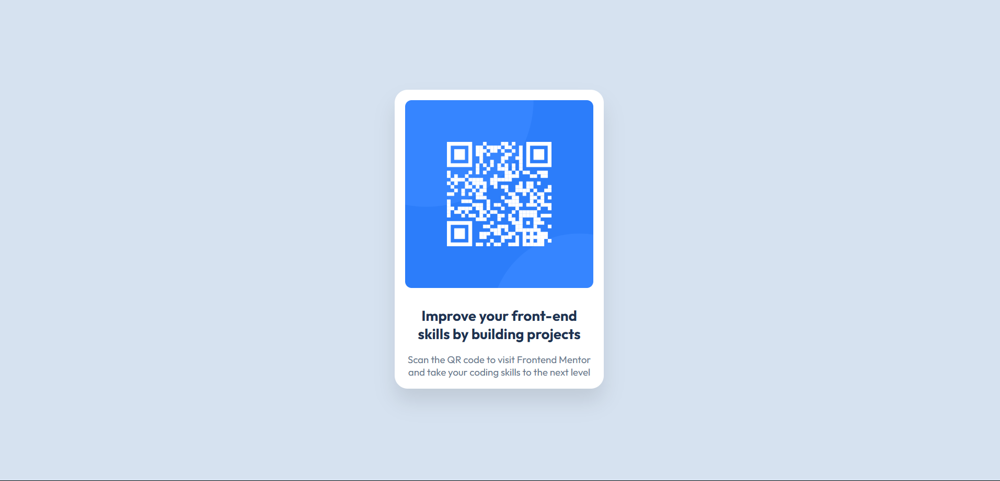

# QR Code Component

## Overview

This challenge was to build a pixel-perfect QR code component resembling the Figma design.

- **Mobile:** 375 px
- **Desktop:** 1440 px
- **Technologies:** HTML5, CSS3, Google Fonts (Outfit)

## Features

1. Responsive card that centers on all screen sizes
2. Pixel-perfect spacing, border-radius, and shadows
3. Uses a fluid layout with `max-width` and media query for mobile

## Screenshot

## Links

- Live Site URL: https://oludami23.github.io/qr-code-component/
- Repository URL: https://github.com/oludami23/qr-code-component

## What I Learned

- How to implement fluid layouts with `max-width`
- Responsive design techniques for fixed-width cards
- Deploying static sites on GitHub Pages, Netlify, and Vercel

## Author

Coded by **OluDami**. Feel free to leave feedback!

